# Mã Mermaid cho các Sơ đồ Tuần tự (Sequence Diagrams)

Do cấu trúc tệp `.drawio` thuần túy sử dụng hệ tọa độ rất phức tạp (khó có thể tự sinh code XML chuẩn xác về mặt giao diện, dễ dẫn đến các đường thẳng và hộp bị đè lên nhau), mình đã chuẩn bị một file `.drawio` với đầy đủ các trang trắng (tab) tương ứng. 

Để vẽ các sơ đồ này lên file `.drawio` một cách nhanh, đẹp và chuẩn xác nhất, bạn hãy dùng tính năng sinh sơ đồ tự động của Draw.io theo hướng dẫn sau:
1. Mở trang tương ứng trong file `sequence_diagrams.drawio` (ví dụ: Hình 3.10 Đăng ký)
2. Trên thanh menu, chọn **Arrange (Sắp xếp)** -> **Insert (Chèn)** -> **Advanced (Nâng cao)** -> **Mermaid...**
3. Copy đoạn mã tương ứng bên dưới và dán vào hộp thoại, sau đó nhấn **Insert**. Draw.io sẽ tự động căn chỉnh và vẽ ra sơ đồ tuần tự tuyệt đẹp cho bạn.

*Lưu ý theo yêu cầu của bạn: Các sơ đồ dưới đây được viết hoàn toàn bằng ngôn ngữ mô tả luồng nghiệp vụ tự nhiên, KHÔNG chứa code (như gọi hàm, if/else lập trình, truy vấn SQL...).*

---

### Hình 3.10: Sơ đồ tuần tự: Đăng ký tài khoản + OTP email
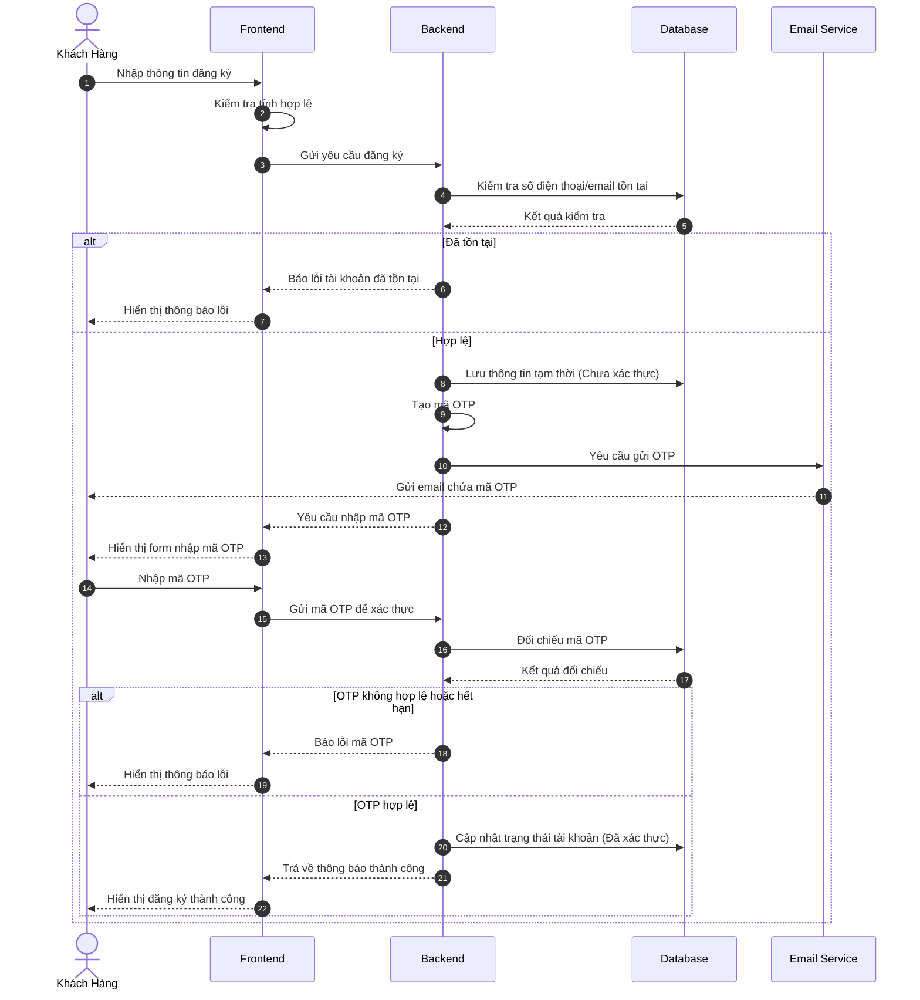

---

### Hình 3.11: Sơ đồ tuần tự: Đăng nhập (PBKDF2 + Zustand)
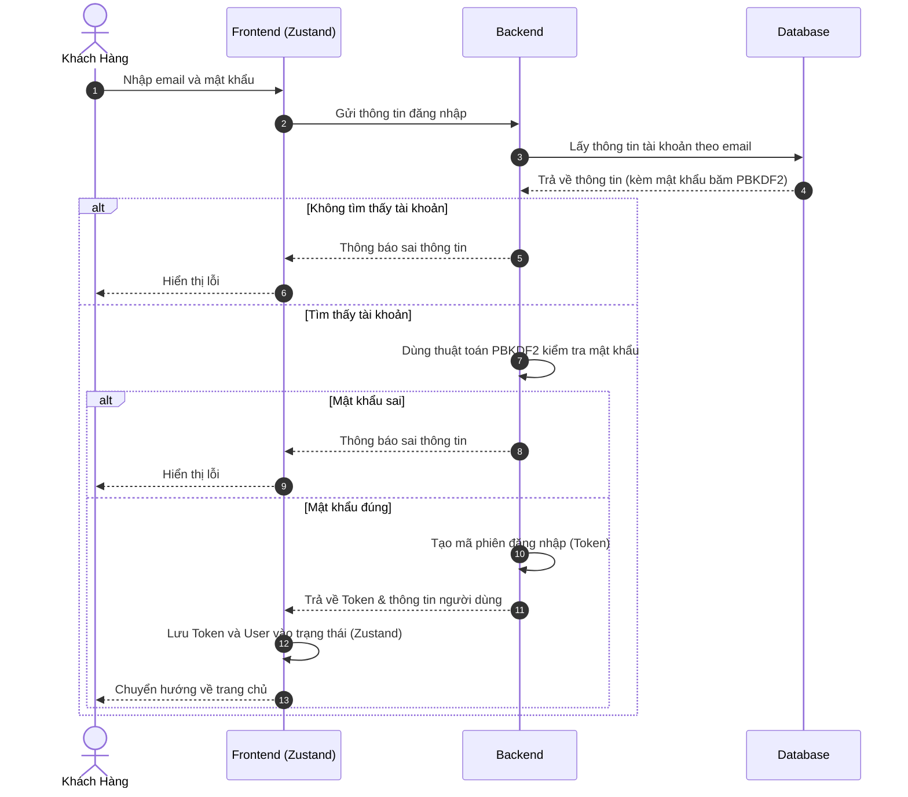

---

### Hình 3.12: Sơ đồ tuần tự: Tra cứu / danh sách sản phẩm
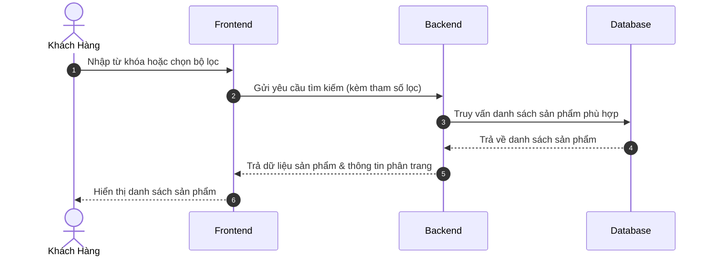

---

### Hình 3.13: Sơ đồ tuần tự xem chi tiết sản phẩm
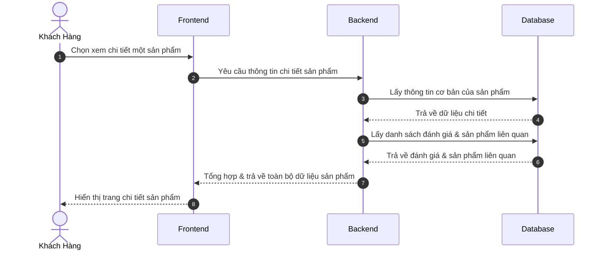

---

### Hình 3.14: Sơ đồ tuần tự giỏ hàng (Zustand)
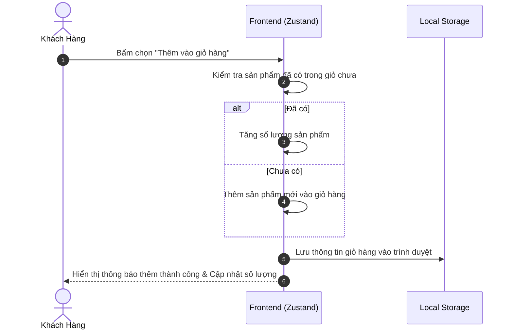

---

### Hình 3.15: Sơ đồ tuần tự: Đặt hàng / Checkout (createOrder)
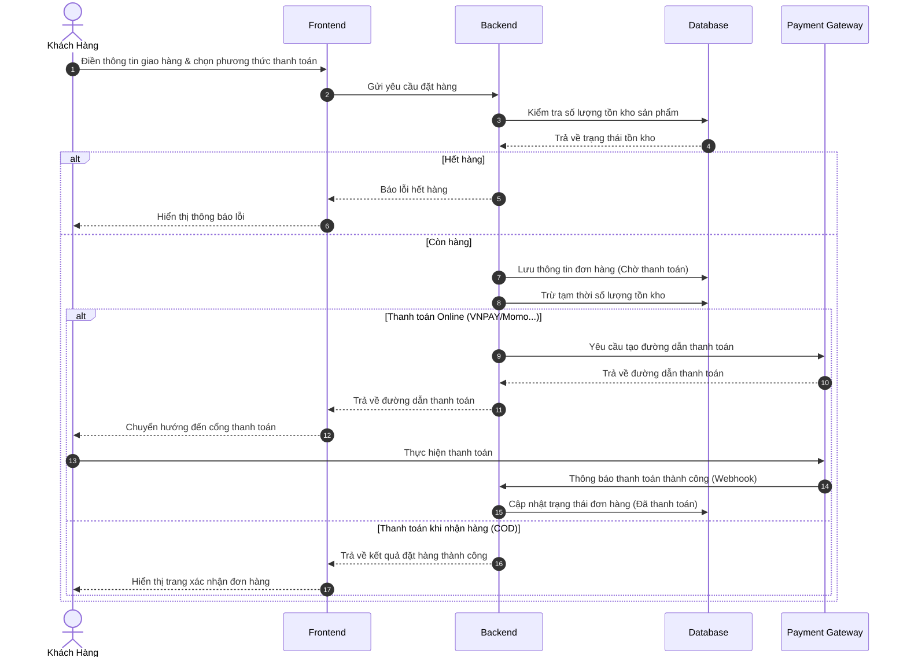

---

### Hình 3.16: Sơ đồ tuần tự: Theo dõi đơn hàng & timeline
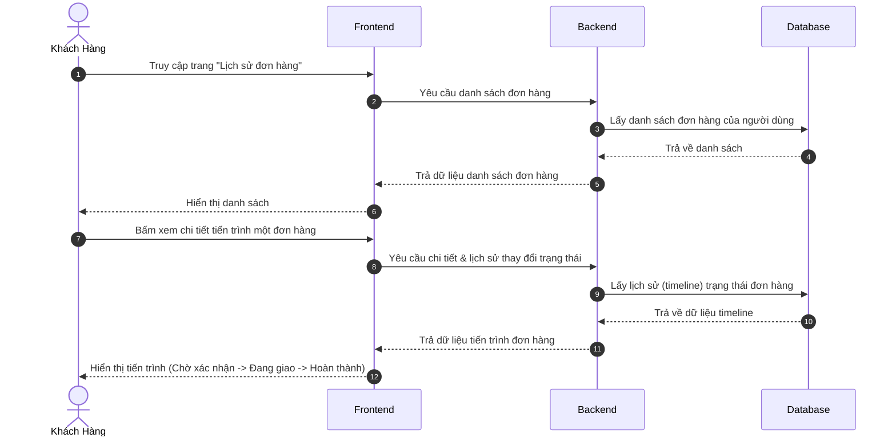

---

### Hình 3.17: Sơ đồ tuần tự: Admin thêm sản phẩm + upload ảnh
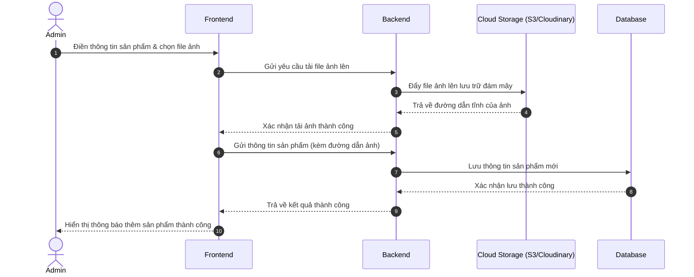

---

### Hình 3.18: Sơ đồ tuần tự: Admin COMPLETED → sinh bảo hành
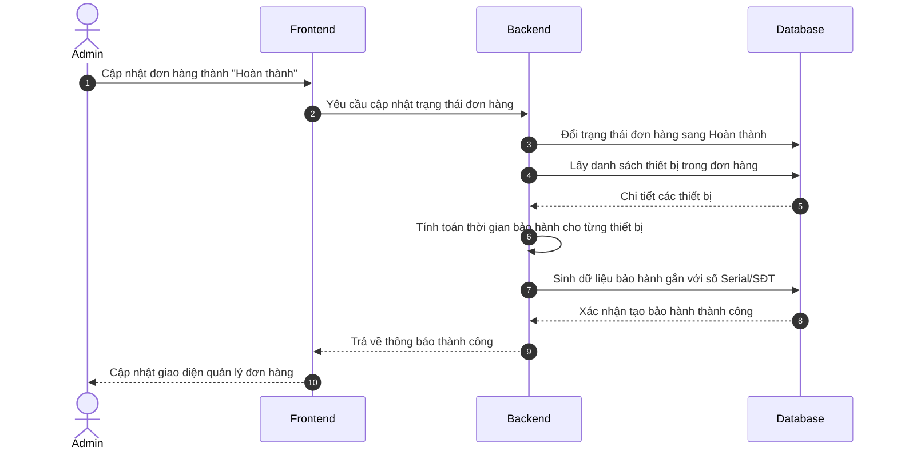

---

### Hình 3.19: Sơ đồ tuần tự: Admin hủy đơn CANCELLED + hoàn kho
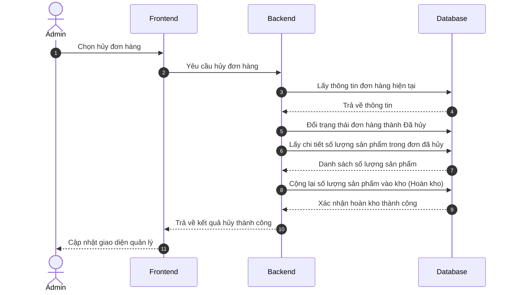

---

### Hình 3.20: Sơ đồ tuần tự: Tra cứu bảo hành theo SĐT/Serial
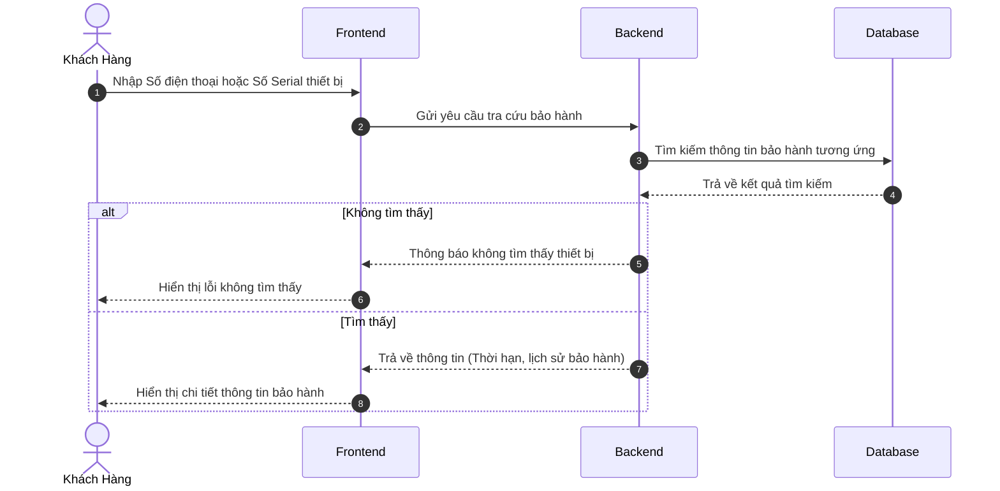

---

### Hình 3.21: Sơ đồ tuần tự: Tạo yêu cầu bảo hành (ticket)
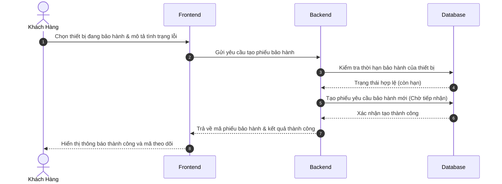

---

### Hình 3.22: Sơ đồ tuần tự: Dùng thử sản phẩm + đặt cọc
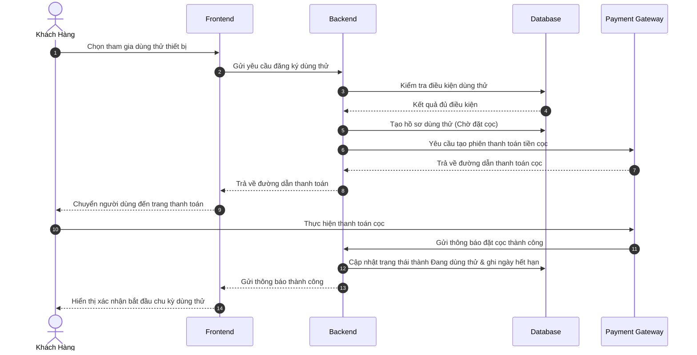

---

### Hình 3.23: Sơ đồ tuần tự: Cron trial-check hết hạn dùng thử
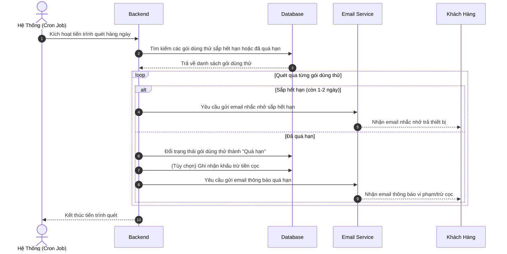
